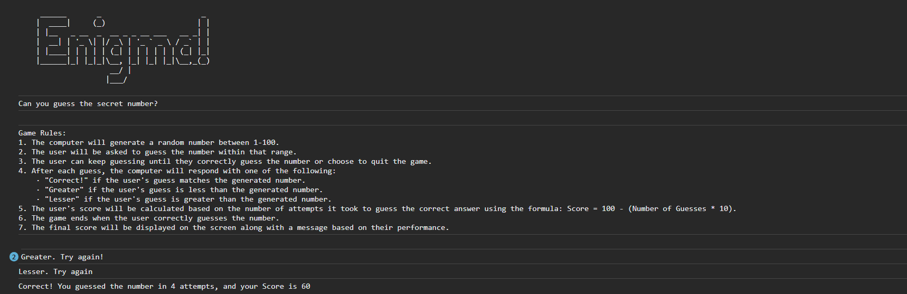

# Guess the Number Game

## Overview
This is a simple command-line game where the player tries to guess a secret number generated by the computer. The game provides feedback to the player after each guess and calculates their score based on the number of attempts it took to guess the correct number.

## How to Play
1. The computer will generate a random number between 1 and 100.
2. You'll be asked to guess the number within that range.
3. Keep guessing until you correctly guess the number or choose to quit the game.
4. After each guess, the computer will respond with one of the following:
   - "Correct!" if your guess matches the generated number.
   - "Greater" if your guess is less than the generated number.
   - "Lesser" if your guess is greater than the generated number.
5. Your score will be calculated based on the number of attempts using the formula: `Score = 100 - (Number of Guesses * 10)`.
6. The game ends when you correctly guess the number.
7. The final score will be displayed along with a message based on your performance.

## How to Run
1. Clone this repository to your local machine.
2. Open your terminal or command prompt.
3. Navigate to the directory where you cloned the repository.
4. Run the game using a JavaScript interpreter (e.g., Node.js):

## Getting Started
1. Fork and clone this repository.
2. Customize the game as needed or make improvements.
3. Have fun and challenge your friends to beat your high score!

## License
This project is licensed under the MIT License - see the [LICENSE](LICENSE) file for details.
